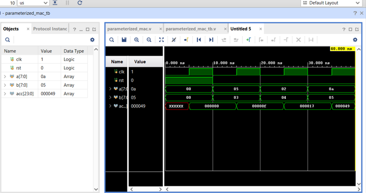
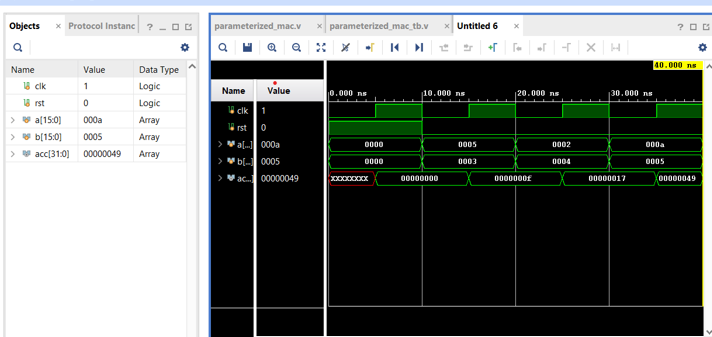
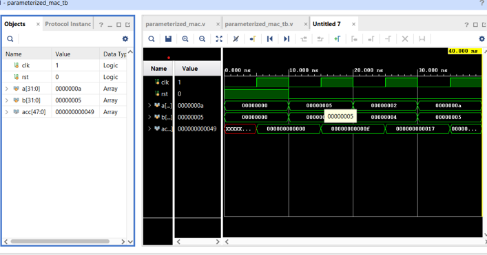
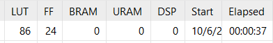
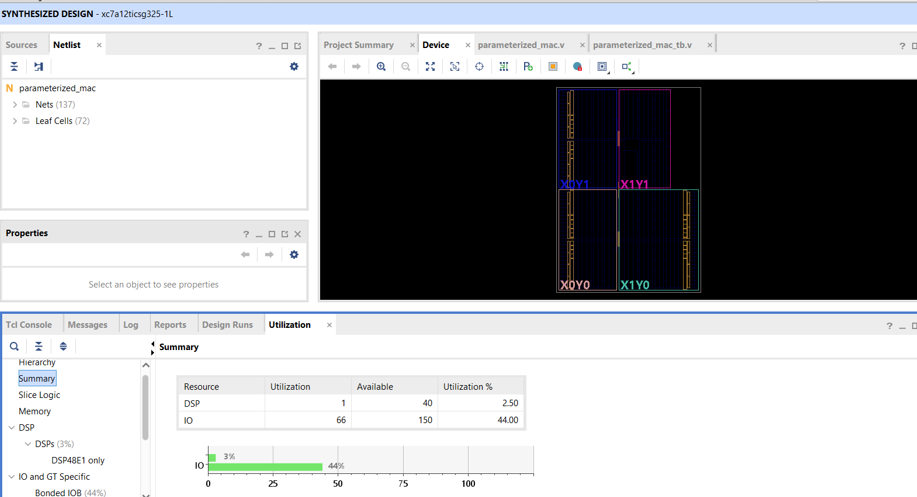
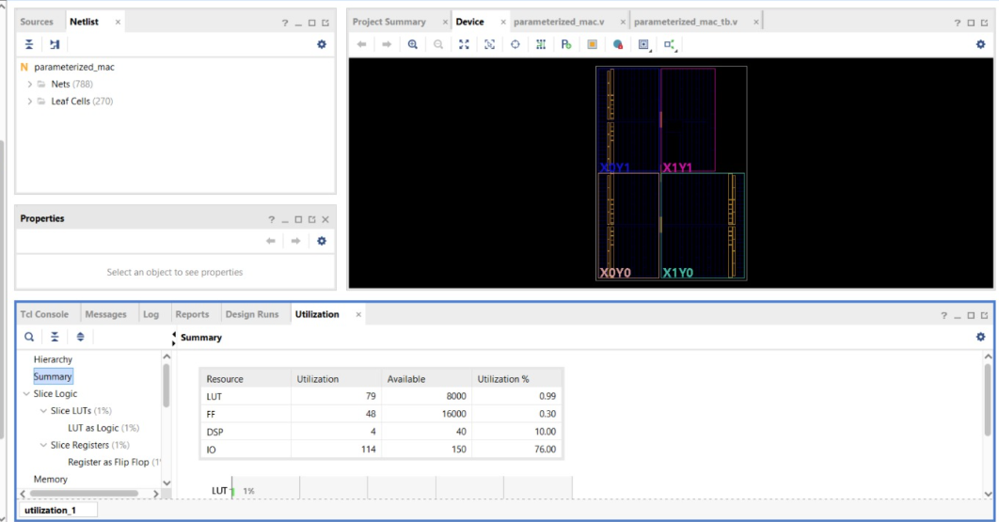
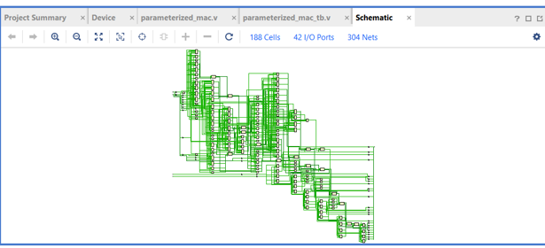

# Parameterized MAC — FPGA Resource & DSP Scaling Study

A configurable Verilog Multiply-Accumulate (MAC) unit implemented and synthesized on a Xilinx FPGA using Vivado 2025.2.

The objective of this project is to study how **operand width affects FPGA resource utilization and DSP inference**. The same parameterized RTL was evaluated at 8-bit, 16-bit and 32-bit configurations.

This project serves as a foundational hardware block for future **FPGA-based AI/ML acceleration**, where MAC operations form the core computation of convolution and matrix multiplication.

---

## Project Overview

A Multiply-Accumulate operation performs:

```text
ACC_next = ACC + (A × B)
```

MAC units are fundamental building blocks in:

- CNN convolution
- Matrix multiplication
- Digital Signal Processing
- Neural-network accelerators
- FPGA-based AI hardware

Instead of implementing separate MAC designs for different operand sizes, this project uses a **parameterized RTL architecture**.

```verilog
parameter DATA_WIDTH = 8;
parameter ACC_WIDTH  = 24;
```

The same RTL can therefore be configured for different arithmetic widths without rewriting the core datapath.

---

## Architecture

```text
        A ─────┐
               │
               ▼
          ┌─────────┐
        B ─►MULTIPLIER
          └────┬────┘
               │
               ▼
          ┌─────────┐
   ACC ──►│  ADDER  │
          └────┬────┘
               │
               ▼
          ┌─────────┐
          │   ACC   │
          │ REGISTER│
          └────┬────┘
               │
               ▼
             Output
```

The MAC operates synchronously with the clock:

```verilog
if (rst)
    acc <= 0;
else
    acc <= acc + (a * b);
```

---

## Parameterization

The design exposes two main parameters:

| Parameter | Description |
|---|---|
| `DATA_WIDTH` | Width of input operands A and B |
| `ACC_WIDTH` | Width of the accumulator |

The design was evaluated using:

| Configuration | Operand Width | Accumulator |
|---|---:|---:|
| 8-bit | 8 × 8 | 24-bit |
| 16-bit | 16 × 16 | 32-bit |
| 32-bit | 32 × 32 | 48-bit |

This allows the effect of increasing arithmetic precision on FPGA implementation resources to be studied using the same RTL architecture.

---

# Functional Verification

A dedicated Verilog testbench was created to verify the MAC operation.

The testbench:

- Generates the clock
- Applies reset
- Provides multiple input vectors
- Observes the accumulated result
- Terminates the simulation automatically

Example sequence:

```text
A = 5,  B = 3  → 15
A = 2,  B = 4  →  8
A = 10, B = 5  → 50
```

Therefore:

```text
15 + 8 + 50 = 73
```

The final accumulator value observed in simulation is:

```text
0x49 = 73
```

---

# Simulation Results

## 8-bit MAC



The waveform confirms the expected clocked accumulation behavior.

The accumulator progresses through the expected sequence:

```text
0 → 15 → 23 → 73
```

with the final result:

```text
0x49 = 73
```

---

## 16-bit MAC



The same MAC architecture was configured for 16-bit operands.

The waveform demonstrates that the parameterized RTL continues to function correctly after increasing the operand width.

---

## 32-bit MAC



The MAC was further scaled to 32-bit operands.

The waveform demonstrates the same accumulation behavior using the wider datapath.

---

# FPGA Synthesis

Synthesis was performed using:

**Vivado 2025.2**

Target FPGA:

**Xilinx Artix-7 — `xc7a12ticsg325-1L`**

The purpose of synthesis was to analyze how the parameterized arithmetic datapath is mapped onto FPGA resources, particularly the dedicated DSP blocks.

---

# Experimental Results

The main objective of the experiment was to observe resource scaling as the operand width increased.

## Resource Comparison

| Configuration | LUTs | FFs | DSPs | I/O |
|---|---:|---:|---:|---:|
| 8-bit | 86 | 24 | 0 | 42 |
| 16-bit | 79 | 48 | 1 | 66 |
| 32-bit | 79 | 48 | 4 | 114 |

The most significant observation is the increase in DSP usage.

### DSP Scaling

```text
8-bit   → 0 DSPs
16-bit  → 1 DSP
32-bit  → 4 DSPs
```

This demonstrates that Vivado begins mapping wider multiplication operations onto dedicated FPGA DSP resources.

---

# 8-bit Synthesis



Resource utilization:

```text
LUT  : 86
FF   : 24
DSP  : 0
BRAM : 0
URAM : 0
I/O  : 42
```

The 8-bit configuration did not require a dedicated DSP block.

This provides the baseline implementation for comparison with the wider configurations.

---

# 16-bit Synthesis



The 16-bit configuration resulted in:

```text
DSP = 1
```

Vivado inferred a dedicated DSP resource for the arithmetic operation.

This represents the first transition from a LUT-oriented implementation toward dedicated FPGA arithmetic resources.

---

# 32-bit Synthesis



The 32-bit configuration resulted in:

| Resource | Used | Available | Utilization |
|---|---:|---:|---:|
| LUT | 79 | 8000 | 0.99% |
| FF | 48 | 16000 | 0.30% |
| DSP | 4 | 40 | 10.00% |
| I/O | 114 | 150 | 76.00% |

The synthesized design uses:

```text
4 × DSP48E1
```

for the 32-bit MAC implementation.

Therefore, the design consumes:

```text
4 / 40 = 10%
```

of the available DSP resources on the target device.

---

# Resource Scaling Analysis

The experiment demonstrates an important FPGA design principle:

> The same RTL operation can map to different hardware resources depending on operand width and synthesis decisions.

The observed DSP scaling is:

| Data Width | DSPs Used | DSP Utilization |
|---:|---:|---:|
| 8-bit | 0 | 0% |
| 16-bit | 1 | 2.5% |
| 32-bit | 4 | 10% |

Conceptually:

```text
Increasing Data Width
        │
        ▼
Larger Multiplier
        │
        ▼
Higher Arithmetic Requirement
        │
        ▼
DSP Inference
        │
        ▼
Multiple DSP Blocks
```

The 32-bit configuration therefore provides a useful demonstration of how arithmetic width can directly influence FPGA resource consumption.

---

# Synthesized Hardware



The synthesized netlist was inspected in Vivado to observe the hardware generated from the RTL.

This provides a structural view of how the high-level Verilog MAC is transformed into FPGA implementation logic.

---

# Why DSP Inference Matters

Modern FPGAs contain dedicated DSP slices optimized for arithmetic operations such as multiplication and accumulation.

This is particularly important for AI/ML workloads because neural-network computation contains a very large number of MAC operations.

A convolution can be simplified to:

```text
Input × Weight
      │
      ▼
  Multiply
      │
      ▼
     Add
      │
      ▼
 Accumulate
```

Large CNN workloads repeat this operation many times.

Efficient mapping of these operations onto FPGA DSP resources is therefore an important consideration when designing hardware accelerators.

---

# Relevance to AI/ML Hardware

The MAC developed here represents a basic processing element that can be scaled into a larger compute architecture.

For example:

```text
                 ┌─────────┐
Input ──────────►│  MAC 0  │──┐
                 └─────────┘  │
                              │
                 ┌─────────┐  │
Input ──────────►│  MAC 1  │──┤
                 └─────────┘  │
                              ├──► Output
                 ┌─────────┐  │
Input ──────────►│  MAC 2  │──┤
                 └─────────┘  │
                              │
                 ┌─────────┐  │
Input ──────────►│  MAC N  │──┘
                 └─────────┘
```

An array of such processing elements can form the computational core of an FPGA-based CNN accelerator.

This makes the present MAC implementation a foundation for future work involving:

- Parallel MAC arrays
- Processing elements
- Convolution engines
- Matrix multiplication
- CNN acceleration
- YOLO workload mapping

---

# Key Engineering Observations

### 1. Parameterization enables scalability

A single RTL design supports multiple arithmetic widths without rewriting the datapath.

### 2. DSP inference is width-dependent

The 8-bit implementation used no DSP resources, while the wider implementations inferred dedicated DSP blocks.

### 3. Wider arithmetic increases hardware cost

Increasing the operand width from 8-bit to 32-bit resulted in increased DSP and I/O utilization.

### 4. Synthesis results are FPGA-dependent

DSP inference depends on the architecture of the target FPGA and the synthesis tool.

### 5. RTL functionality is only one part of FPGA design

A design can be functionally correct while still having very different hardware costs after synthesis.

Therefore, resource utilization and synthesis analysis are essential parts of FPGA hardware development.

---

# Design Flow

The complete workflow followed in this project was:

```text
Verilog RTL
    │
    ▼
Parameterized MAC
    │
    ▼
Verilog Testbench
    │
    ▼
Behavioral Simulation
    │
    ▼
Vivado Synthesis
    │
    ▼
Resource Utilization Analysis
    │
    ▼
DSP Inference Analysis
    │
    ▼
Synthesized Netlist
```

---

# Repository Structure

```text
parameterized_mac/
│
├── par_mac_rtl.v
├── par_mac_tb.v
│
├── 8bit.png
├── 8bit_wv.png
│
├── 16bit.png
├── 16bit_wv.png
│
├── 32bit.png
├── 32bit_wv.png
│
├── schematic.png
│
└── README.md
```

---

# Conclusion

This project demonstrates a complete FPGA arithmetic design workflow using a parameterized MAC architecture.

The design was:

**Designed → Parameterized → Simulated → Synthesized → Analyzed**

The key experimental result was the observed DSP scaling:

```text
8-bit   → 0 DSP
16-bit  → 1 DSP
32-bit  → 4 DSPs
```

The experiment demonstrates how increasing arithmetic width changes the underlying FPGA resource mapping and motivates the need for careful hardware-resource analysis when designing AI/ML accelerators.

The MAC will serve as a foundational compute block for future work involving **parallel processing elements, CNN acceleration, and FPGA-based YOLO workloads**.

---

## Author

**Snigdha Bhardwaj**

B.Tech — Electronics & Communication Engineering  
NSUT

**Interests:**  
FPGA · RTL Design · VLSI · Hardware Acceleration · AI/ML Hardware · CNN Accelerators
```
